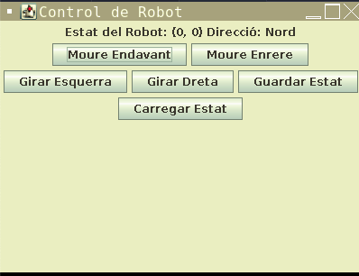

## Desenvolupament d'una Aplicació Visual de Robots

### Context:

Heu de desenvolupar una aplicació visual que simuli el control d'un robot. Aquesta aplicació haurà d'incloure una interfície gràfica d'usuari (GUI) per controlar el robot, així com operacions d'entrada i sortida d'informació, tant per consola com per fitxers. La prova tindrà en compte la capacitat dels alumnes per utilitzar les eines de l'entorn de desenvolupament, programar controladors d'esdeveniments, i gestionar operacions bàsiques d'entrada/sortida.

### Objectius de la Prova:

1. Crear una interfície gràfica d'usuari per a controlar un robot.
2. Programar els esdeveniments per interactuar amb el robot.
3. Gestionar l'entrada i sortida d'informació per consola i fitxers.

### Estructura de la Prova:

1. **Inici del projecte:**
    - Creació del projecte i configuració inicial de la GUI
    - Definició de les funcionalitats bàsiques del robot (moure, girar)
2. **Desenvolupament de la GUI:**
    - Implementació de la finestra principal i els controls necessaris
    - Programació dels controladors d'esdeveniments per als botons
3. **Implementació d’operacions de consola i fitxers:**
    - Funcionalitats per rebre ordres i mostrar l'estat per consola
    - Funcionalitats per guardar i carregar l'estat del robot mitjançant fitxers

### Eines Recomanades:

- **Java** amb **JavaFX/Swing** per la GUI, i **[java.io](http://java.io/)** per la gestió de fitxers.